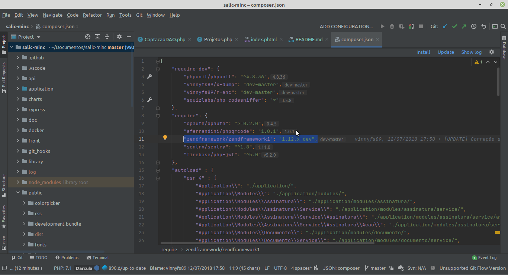

<h1>Nota T&eacute;cnica<h1>
<h4>Conforme apontado na  CVE-2021-3007, essa vulnerabilidade atinge a versão do Zend Framework 3, apontado em nota t&eacute;cnica pela comunidade no link abaixo (criando um projeto do zero com Zend Framework 3). Essa &eacute; uma vulnerabilidade de desserialização de segurança no framework, que pode levar à execução remota de c&oacute;digo se o conte&uacute;do for control&aacute;vel relacionado ao  m&eacute;todo  __destruct da  classe Zend \ Http \ Response \ Stream  em  Stream.php
<h4>
<h4>Mas não se preocupe (por enquanto rs), pois o Portal Vale Cultura contempla a versão do Zend Framework 1.12.3, conforme arquivo "Version.php"<h4>

<h3>Referências<h3>

<h5>https://github.com/Ling-Yizhou/zendframework3-/blob/main/zend%20framework3%20%E5%8F%8D%E5%BA%8F%E5%88%97%E5%8C%96%20rce.md<h5>
<h5>https://nvd.nist.gov/vuln/detail/CVE-2021-3007<h5>
<h5>https://meterpreter.org/CVE-2021-3007-zend-framework-remote-code-execution-vulnerability-alert/
<h5>

  

