# Documentação Avaliação de Resultados - Laudo Final

## Como acessar o Laudo Final no perfil Coordenador Geral

* Primeiro passo precisa esta logado como Coordenador Geral de Prestação de Contas.
* Segundo passo v&aacute; em Avaliação de Resultados->Analisar laudo final.

### Avaliação de Resultados: Laudo Final
* Na p&aacute;gina do Laudo Final tem um Painel com as abas 'Em Analise', 'Assinar', 'Em Assinatura' e 'Finalizados'.
* Cada aba vai ter uma tabela com a listagem dos projetos de acordo com o estado atual e um campo para pesquisar por um projeto expec&iacute;fico.

    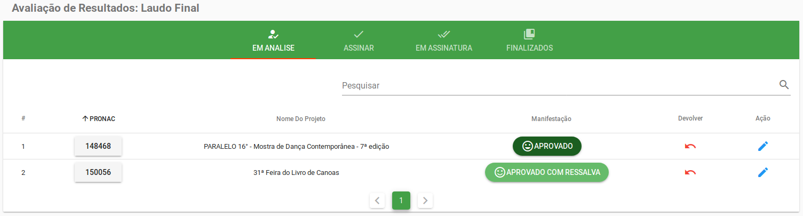
### Tabela dos projetos
* A tabela &eacute; montada com os itens 'PRONAC', 'Nome do projeto', 'Manifestação', 'Devolver' e 'Ação'.
* Nos itens 'PRONAC' e 'Manifestação', são executadas ações comum a todas as abas do painel.
* No item 'Devolver', a funcionalidade se difere apenas na aba Em An&aacute;lise.
* A 'Ação' no projeto muda conforme o estado do projeto.

#### Consultar Dados do Projeto
* Ao clicar no n&uacute;mero do Pronac o usu&aacute;rio &eacute; redirecionado para o m&oacute;dulo de `Projetos` podendo visualizar os dados do projeto.

    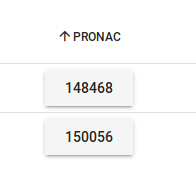

#### Visulizar o Parecer t&eacute;cnico
* Clique na manifestação do projeto.
    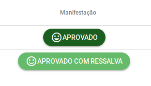
* Ao clicar vai abrir uma modal para visualizar o parecer emitido pelo t&eacute;cnico.
    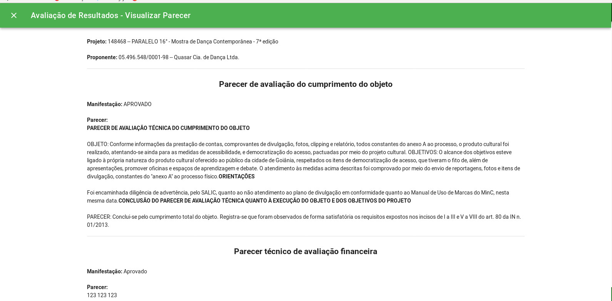

#### Devolver
* Clique no botão devolver.

    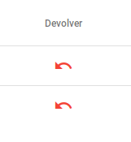
* Em seguida vai abrir uma modal para que confirme a devolução com o Pronac e o nome do projeto selecionado.
    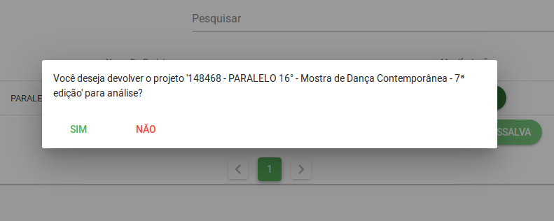
##### - Parecer T&eacute;cnico
* Estar&aacute; sendo feita a devolução do parecer tecnico quando clicado no botão Devolver da aba Em An&aacute;lise.
* Se confirmada a devolução, o parecer do t&eacute;cnico &eacute; invalidado o e projeto volta pra _Avaliação de Resultados: Analisar Parecer_, finalizando o fluxo do projeto no laudo final.
##### - Laudo final
* Estar&aacute; sendo feita a devolução do laudo final quando clicado no botão Devolver das demais abas.
* Confirmada a devolução, o Laudo Final &eacute; invalidado, o estado do projeto muda e ele volta para a aba Em An&aacute;lise para ser criado um novo laudo, reiniciando o fluxo do projeto no laudo final.

### Em An&aacute;lise
* Na primeira aba do painel, Em An&aacute;lise, são listados os projetos que ainda não possui um documento de laudo final gerado.
    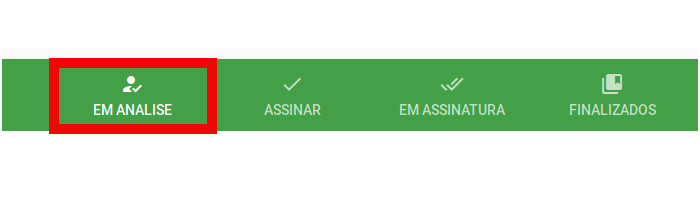
* Na ação &eacute; poss&iacute;vel emitir o laudo final.

#### Emitir Laudo Final
* Clique na ação da aba Em An&aacute;lise.

    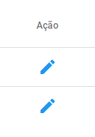

* Uma modal vai abrir para que o usu&aacute;rio crie o laudo final.
    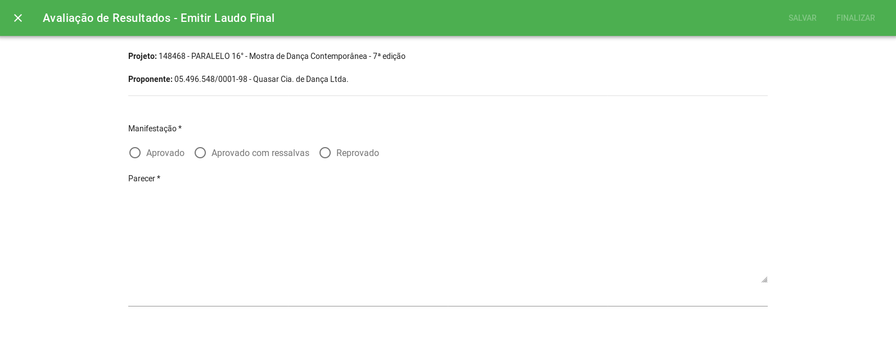
* &eacute; necess&aacute;rio o preenchimento de todos os campos para que o laudo seja gerado.
* O usu&aacute;rio tem duas opções no canto superior direito: 1) Salvar, criando assim apenas um rascunho do laudo; 2) Finalizar, que estar&aacute; salvando, gerando o documento do laudo final e mudando o estado do projeto para iniciar o fluxo de assinaturas.

    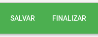

### Assinar
* Segunda aba do painel onde são listados os projetos que j&aacute; possuem um laudo final gerado por&eacute;m não teve nenhuma assinatura ainda.
    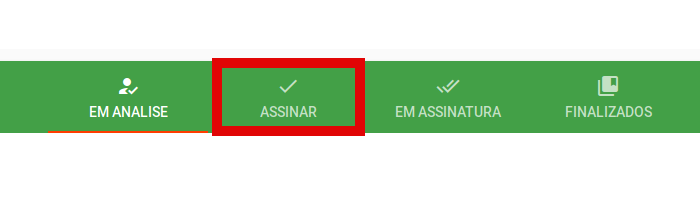
* A ação dispon&iacute;vel nessa aba &eacute; para assinar o documento.

#### Assinar Laudo
* Ao clicar na ação da aba Assinar o sistema redireciona para o m&oacute;dulo de `Assinatura` onde ser&aacute; assinado o documento do laudo final.
* Quem deve assinar &eacute; o pr&oacute;prio coordenador geral, criador do documento.

    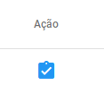

### Em Assinatura
* Terceira aba do painel, a listagem apresenta os projetos que j&aacute; possuem um laudo final emitido e este j&aacute; foi assinado pelo menos pelo Coordenador Geral, mas ainda não tem todas as assinaturas.
    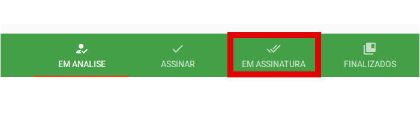
* A ação &eacute; para visualizar o laudo final.

#### Visualizar Laudo
* Clique na ação da aba Em Assinatura.

    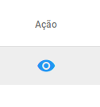
* Uma modal vai abrir apresentado um visualização do laudo final emitido.
    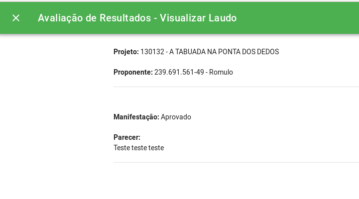

### Finalizados
* Ultima aba do painel com a listagem dos projetos finalizados, ou seja, projetos que j&aacute; possuem um laudo final emitido e este foi assinado por todos os respons&aacute;veis.
    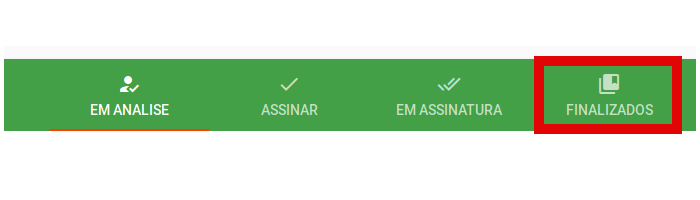
* A ação nessa aba &eacute; para [visualizar o laudo final](#visualizar-laudo) da mesma forma que na aba Em Assinatura.

## Como acessar o Laudo Final no perfil Secret&aacute;rio

* Primeiro passo precisa esta logado como Secret&aacute;rio.
* Segundo passo v&aacute; em Avaliação de Resultados->Analisar laudo final.

### Avaliação de Resultados: Laudo Final
* Na p&aacute;gina do Laudo Final tem um Painel com a aba 'Em Assinatura'.
* Nessa aba vai ter um campo para pesquisar por um projeto expec&iacute;fico e uma tabela com a listagem dos projetos que ja possuem um laudo final emitido e este ja foi assinado pelo _Coordenador Geral de Prestação de Contas_.

    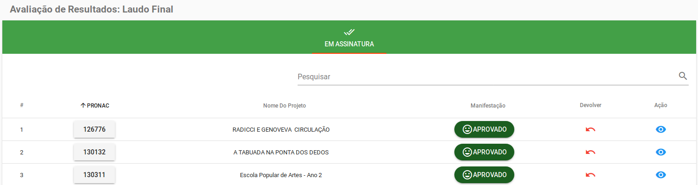
### Tabela de listagem
* A [tabela](#tabela-dos-projetos) &eacute; a mesma do perfil do Coordenador geral.
* No campo _Devolver_, o Secret&aacute;rio vai poder estar devolvendo o [Laudo final](#laudo-final).
* Na 'Ação', &eacute; poss&iacute;vel [Visualizar o laudo](#visualizar-laudo) emitido.

## Como acessar o Laudo Final no perfil Diretor

* Primeiro passo precisa esta logado como Diretor de Departamento.
* Segundo passo v&aacute; em Avaliação de Resultados->Analisar laudo final.

### Avaliação de Resultados: Laudo Final
 [Segue da mesma forma que o perfil do secret&aacute;rio](#avaliação-de-resultados-laudo-final-1)
