# Documentação Parecer T&eacute;cnico

## Como acessar os Pareceres T&eacute;cnicos no perfil de Coordenador de Prestação de Contas

* Primeiro passo, &eacute; necessário estar logado em um perfil de Coordenador de Prestação de Contas.
* Segundo passo selecione a opção Avaliação de Resultados localizada no menu superior e clique na opção Analisar Parecer.

## Abas

1. ENCAMINHAR
2. EM ANALISE
3. ASSINAR
4. HISTORICO

## Encaminhar

Para visualizar a lista dos projetos aguardando serem encaminhados a um t&eacute;cnico de prestação de contas &eacute; necessário selecionar a aba ENCAMINHAR.

Há uma lista dos projetos a serem encaminhados, havendo a possibilidade de visualizar os dados do projeto ao clicar no número do Pronac e a possibilidade de encaminhar o projeto a um t&eacute;cnico de prestação de contas.

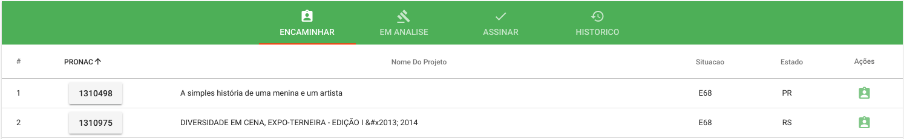

### Aç&otilde;es disponíveis:

#### 1. Encaminhar Projeto

* Primeiro passo, &eacute; necessário clicar na ação Encaminhar Projeto.
* Ap&oacute;s a abertura do formulário de encaminhamento &eacute; preciso selecionar um t&eacute;cnico de prestação de contas e digitar uma justificativa de encaminhamento, para finalizar clique em ENCAMINHAR.

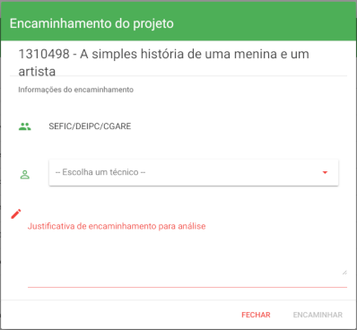

## Em Análise

Para visualizar a lista dos projetos aguardando a assinatura do t&eacute;cnico de prestação de contas &eacute; necessário selecionar a aba EM ANALISE.

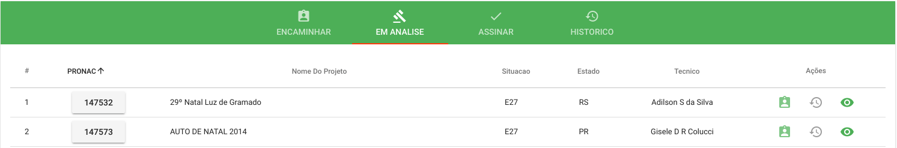

### Aç&otilde;es disponíveis:

#### 1. [Encaminhar Projeto](#1.-encaminhar-projeto)
Esta ação tem como objetivo reencaminhar o projeto a outro t&eacute;cnico de prestação de contas.

#### 2. Hist&oacute;rico de Encaminhamentos
Visualizar o hist&oacute;rico de encaminhamentos do projeto.

#### 3. Visualizar Projeto
Ao clicar na ação, &eacute; aberta a planilha orçamentaria do projeto.

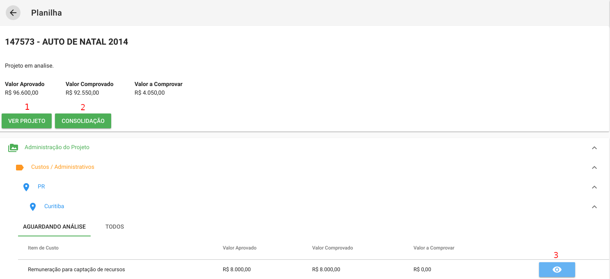

Dentro da planilha &eacute; possível(de acordo com a numeração da imagem acima):
1. Visualizar dados sobre o projeto.
2. Visualizar dados acerca da consolidação do projeto.
3. Visualizar os comprovantes dos items de custo quando disponíveis.

## Assinar

Para visualizar a lista de projetos já assinados pelos respectivos t&eacute;cnicos e aguardando assinatura do coordenador de prestação de contas, &eacute; necessário selecionar aba ASSINAR.

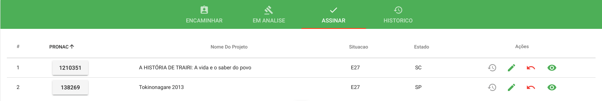

### Aç&otilde;es disponíveis:

#### 1. Hist&oacute;rico de Encaminhamentos

Visualizar o hist&oacute;rico de encaminhamentos do projeto.

#### 2. Assinar

* Para assinar o projeto &eacute; necessário clicar na segunda ação disponível(Assinar)
* Logo ap&oacute;s será aberta a planilha orçamentária semelhante a da ação [Visualizar Projeto](#3.-visualizar-projeto) mas com um menu flutuante presente no canto inferior direito da tela.
* Posicione o cursor do mouse em cima deste menu e selecione a ação Assinar assim como &eacute; mostrado na imagem abaixo.

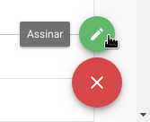

* Ap&oacute;s isso será apresentado na tela o Parecer T&eacute;cnico de Avaliação de Resultado, role at&eacute; o final da página e encontre opç&otilde;es de imprimir este, gerar o .pdf deste documento e o botão de ASSINAR efetivamente o projeto.

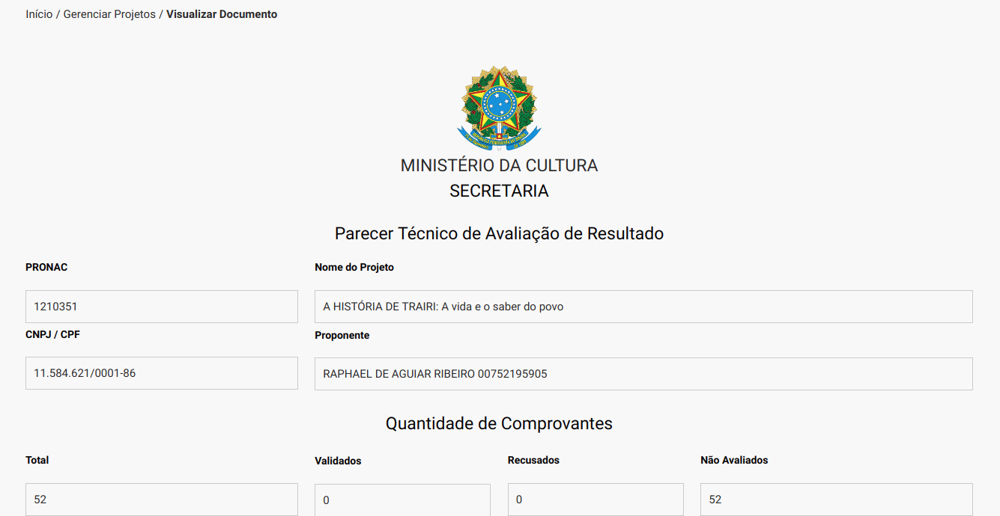

#### 3. Devolver Projeto

Ao selecionar a ação de Devolver Projeto, o coordenador de prestação de contas devolve o projeto assinado ao t&eacute;cnico de prestação de contas para que este seja analisado novamente.

Para concluir a devolução basta confirmar clicando no botão SIM.

#### 4. [Visualizar Projeto](#3.-visualizar-projeto)

Ao clicar na ação, &eacute; aberta a planilha orçamentaria do projeto.

## Historico

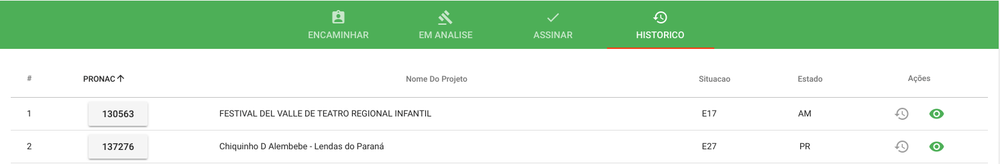

### Aç&otilde;es disponíveis:

#### 1. Hist&oacute;rico de Encaminhamentos

Visualizar o hist&oacute;rico de encaminhamentos do projeto.

#### 2. [Visualizar Projeto](#3.-visualizar-projeto)

Ao clicar na ação, &eacute; aberta a planilha orçamentaria do projeto.

---

## Como acessar os Pareceres T&eacute;cnicos no perfil de T&eacute;cnico de Prestação de Contas

* Primeiro passo, &eacute; necessário estar logado em um perfil de T&eacute;cnico de Prestação de Contas.
* Segundo passo selecione a opção Avaliação de Resultados localizada no menu superior e clique na opção Analisar Parecer.

## Abas

1. EM ANALISE
2. ASSINAR
3. HISTORICO

## Em Análise

Para visualizar a lista dos projetos aguardando a análise do t&eacute;cnico logado &eacute; necessário selecionar a aba EM ANALISE.

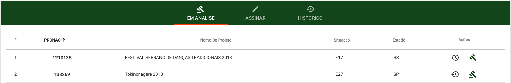

### Aç&otilde;es disponíveis:

#### 1. Hist&oacute;rico de Encaminhamentos
Visualizar o hist&oacute;rico de encaminhamentos do projeto.

#### 2. Analisar Projeto
 O [analisar projeto](#3.-Visualizar-Projeto)  do T&eacute;cnico Prestação de contas e semelhante ao do Coordenador de Prestação de Contas ,por&eacute;m tem as opç&otilde;es de  comprovar item, diligenciar, emitir parecer.

## Assinar

### Aç&otilde;es disponíveis:

#### 1. Hist&oacute;rico de Encaminhamentos

Visualizar o hist&oacute;rico de encaminhamentos do projeto.

#### 2. Assinar

O [assinar](#2.-assinar) do T&eacute;cnico Prestação de contas e semelhante ao do Coordenador de Prestação de Contas

#### 3. Devolver Projeto

O [devolver](#3.-Devolver-Projeto) do T&eacute;cnico Prestação de contas e semelhante ao do Coordenador de Prestação de Contas

#### 4. [Projeto](#3.-visualizar-projeto)

## Historico

### Aç&otilde;es disponíveis:

#### 1. Hist&oacute;rico de Encaminhamentos

Visualizar o hist&oacute;rico de encaminhamentos do projeto.

#### 2. [Visualizar Projeto](#3.-visualizar-projeto)

Ao clicar na ação, &eacute; aberta a planilha orçamentaria do projeto.

---
## Como acessar os Pareceres T&eacute;cnicos no perfil de Coordenador Geral de Prestação de Contas

* Primeiro passo, &eacute; necessário estar logado em um perfil de Coordenador Geral de Prestação de Contas.
* Segundo passo selecione a opção Avaliação de Resultados localizada no menu superior e clique na opção Analisar Parecer.

## Abas

1. EM ANALISE
2. ASSINAR
3. HISTORICO

## Em Análise

Para visualizar a lista dos projetos em análise &eacute; necessário selecionar a aba EM ANALISE.

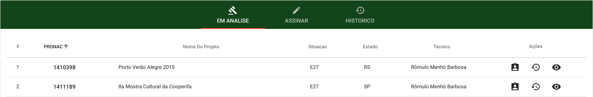

### Aç&otilde;es disponíveis:

#### 1. [Encaminhar Projeto](#1.-encaminhar-projeto)

#### 2. Hist&oacute;rico de Encaminhamentos
Visualizar o hist&oacute;rico de encaminhamentos do projeto.

#### 3. [Visualizar Projeto](#3.-visualizar-projeto)

## Assinar

### Aç&otilde;es disponíveis:

#### 1. Hist&oacute;rico de Encaminhamentos

Visualizar o histórico de encaminhamentos do projeto.

#### 2. Assinar

A ação Assinar do Coordenador Geral de Prestação de contas &eacute; semelhante a ação Assinar do Coordenador de Prestação de Contas e já foi descrita [aqui](#2.-assinar).

#### 3. Devolver Projeto

A ação [Devolver] do Coordenador Geral de Prestação de contas é semelhante a ação Devolver do Coordenador de Prestação de Contas e já foi descrita [aqui](#3.-Devolver-Projeto).

#### 4. [Visualizar Projeto](#3.-visualizar-projeto)

## Historico

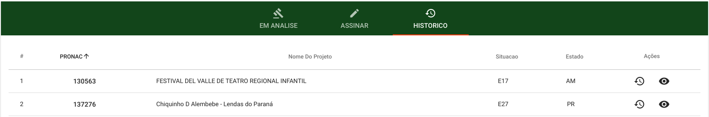

### Aç&otilde;es disponíveis:

#### 1. Histórico de Encaminhamentos

Visualizar o histórico de encaminhamentos do projeto.

#### 2. [Visualizar Projeto](#3.-visualizar-projeto)

Ao clicar na ação, é aberta a planilha orçamentaria do projeto.

